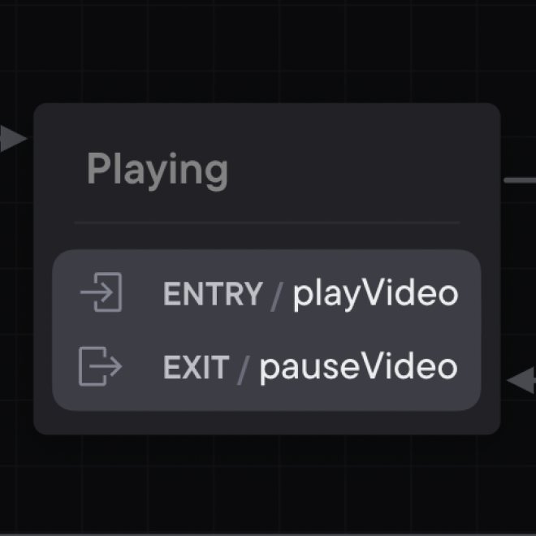

## Entry & exit actions

While the statechart is running, it can execute other effects called actions.

An action can be fired upon entry or exit of a state. Actions are “fire-and-forget effects”; once the machine has fired the action, it moves on and forgets the action. You can also fire actions on transitions.

You can fire multiple entry and exit actions on a state. Top-level final states cannot have exit actions, since the machine is stopped and no further transitions can occur.

[View this machine in Stately Studio](https://stately.ai/registry/editor/e13bef2b-bb13-4465-96ac-0bc25340688e?machineId=222e2d7a-0ed6-4f2c-843a-e6646d717000).

In our video player, we have entry and exit actions on the Playing state. We use the entry action of playVideo to fire an effect playing the video on entry to the Playing state. We use the exit action of pauseVideo to fire an effect pausing the video when the Playing state is exited.
