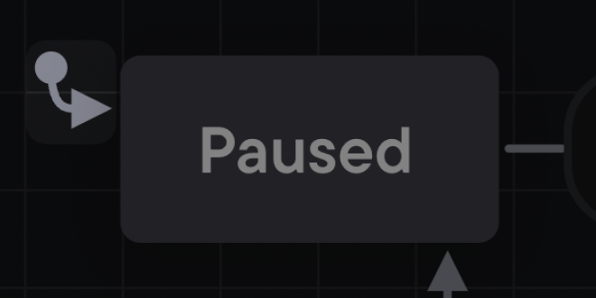

## Initial state

When a state machine starts, it enters the **initial state** first. A machine can only have one top-level initial state; if there were multiple initial states, the machine wouldn’t know where to start!

The filled circle with an arrow icon represents the initial state.

In our video player, paused is the initial state because the video player is paused by default and requires user interaction to start playing.

[View this machine in Stately Studio](https://stately.ai/registry/editor/e13bef2b-bb13-4465-96ac-0bc25340688e?machineId=3ebc8874-2294-480b-a06e-74845337cd8d).
