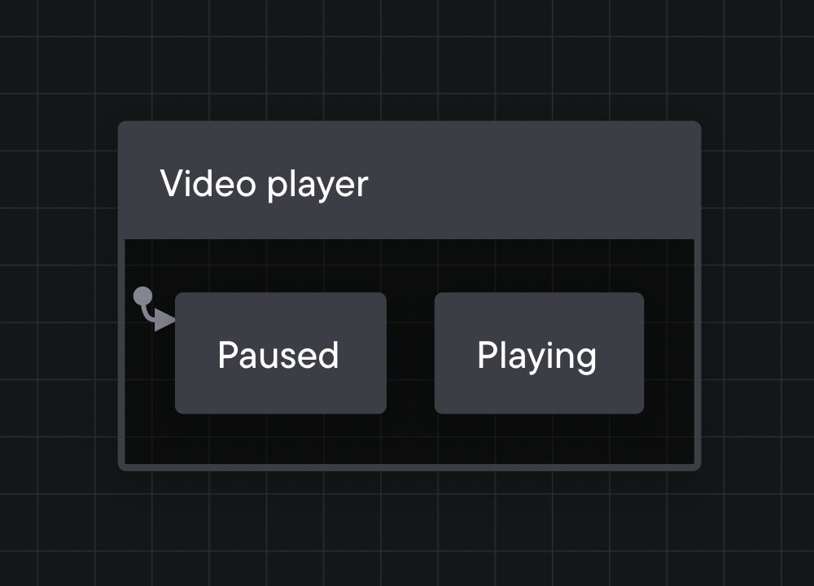

A state describes the machine’s status or mode, which could be as simple as *Paused* and *Playing*. A state machine can only be in one state at a time.

The rounded rectangle boxes are states. These states are “finite”; the machine can only move through the states you’ve pre-defined.
