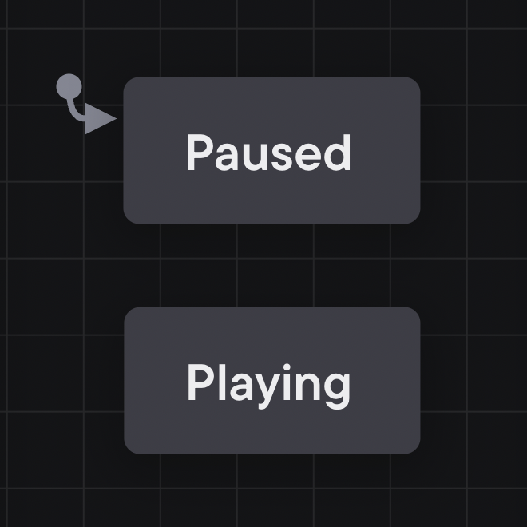

## States

A state describes the machine’s status or mode, which could be as simple as *Paused* and *Playing*. A state machine can only be in one state at a time.

[View this machine in the Stately Studio](https://stately.ai/registry/editor/e13bef2b-bb13-4465-96ac-0bc25340688e?machineId=741f69fd-7f01-4932-9407-6871e225bb6d).

The rounded rectangle boxes are states. These states are “finite”; the machine can only move through the states you’ve pre-defined.
