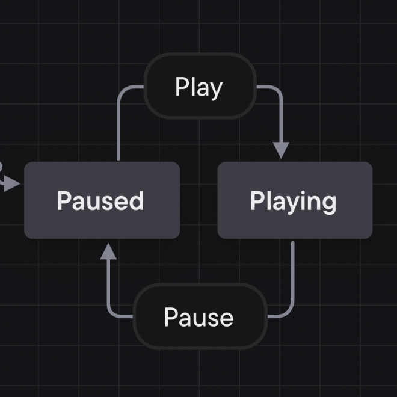

## Events & transitions

A machine moves from state to state through **transitions**. Transitions are caused by events; when an event happens, the machine transitions to the next state.

Transitions are “deterministic”; each combination of state and event always points to the same next state.

The arrows are transitions, and the rounded rectangles on the arrow’s lines are events. Each transition has a **source** state which comes before the transition, and a **target** state, which comes after the transition. The transition’s arrow starts from the source state and points to the target state.

[View this machine in Stately Studio](https://stately.ai/registry/editor/e13bef2b-bb13-4465-96ac-0bc25340688e?machineId=9630e3b7-9f8e-4dc9-8b55-661f854d28b7).

In the video player machine above, the events are *PLAY* and *PAUSE*. The *Play* event transitions from the *Paused* state to the *Playing* state. The *Pause* event transitions from the *Playing* state to the *Paused* state.
